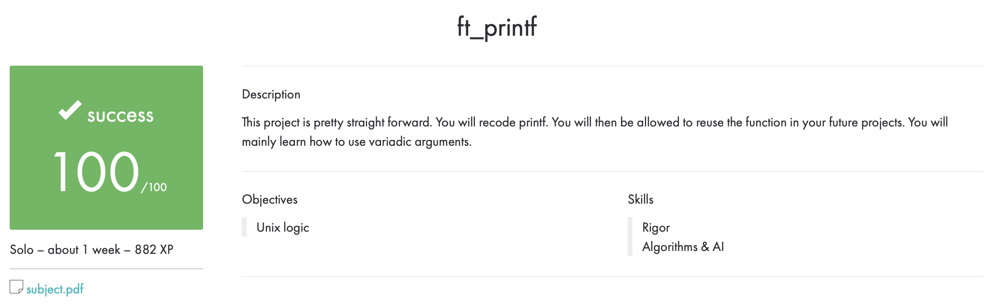

# ft_printf

## Описание

ft_printf - четвертый проект в School 21. Мы перекодируете основную функцию printf. После этого нам будет разрешено повторно использовать эту функцию в наших будущих проектах. В основном мы узнаем, как использовать вариативные аргументы.

Компилирование было с флагами: ``gcc -Wall -Wextra -Werror``.

Все файлы проходят на ``Norminette``.

## Использование

``make`` и ``make all`` собирают библиотеку с проектом, или перекомпилирую измененный файл, так же пересобирая библиотеку.

``make re`` удаляет все ``.o`` файлы, удаляет ``libftprintf.a``, пересобирает библиотеку.

``make clean`` удаляет все ``.o`` файлы.

``make fclean`` удаляет все ``.o`` файлы, так же удаляет ``libftprintf.a``.

## Оценка

## my_test

Вставляем в папку с функциями ``main.c``, компилируем, смотрим на результат. Так же не забывайте проверять все возможные найденые тесты для своего ft_printf. Основа для тестов была взята у [timurmug](https://github.com/timurmug). Убранны все ``undefined behaviour`` тесты, добавлены свои тесты.
